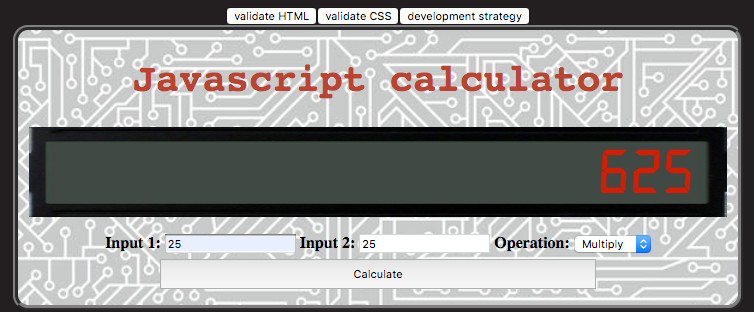

# calculator-refactor
> Starter Code exercise to build a simple Javascript calculator for learn how to model the listener, handler and logic javascript parts of webpages.

## Table of contents
* [General info](#general-info)
* [Screenshots](#screenshots)
* [Technologies](#technologies)
* [Setup](#setup)
* [Features](#features)
* [Status](#status)
* [Inspiration](#inspiration)
* [Contact](#contact)

## General info
The purpose of the project is to start learning and using javascript on webpages, this simple calculator perform the arithmetic operation selected in the dropdown between the two input numbers and show the result on an LCD screen like space.  [Development-strategy.md](./development-strategy.md) file contains the steps used to complete this project, it describes the branches with details about the what is implemented.

## Screenshots

## Technologies
* HTML5
* CSS3
* git
* javascript

## Setup
You can clone or fork this repository and test the files.

## Features
The project features a web site with:
* Calculator with LCD display.
* Simple form to capture the input values.
* Javascript code to process the event and perform the calculation.

## Status
Project is: finished, final version.

## Inspiration
[this tutorial by mmtuts](https://www.youtube.com/watch?v=qQEYAOPWDzk)

## Contact
Created by [@ferrycosv](www.github.com/ferrycosv) - feel free to contact me!